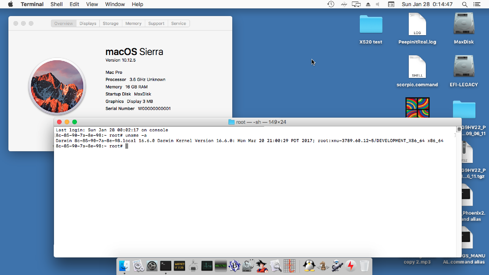
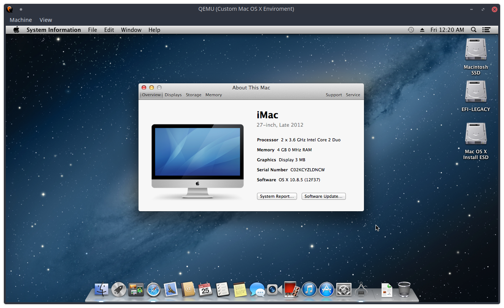
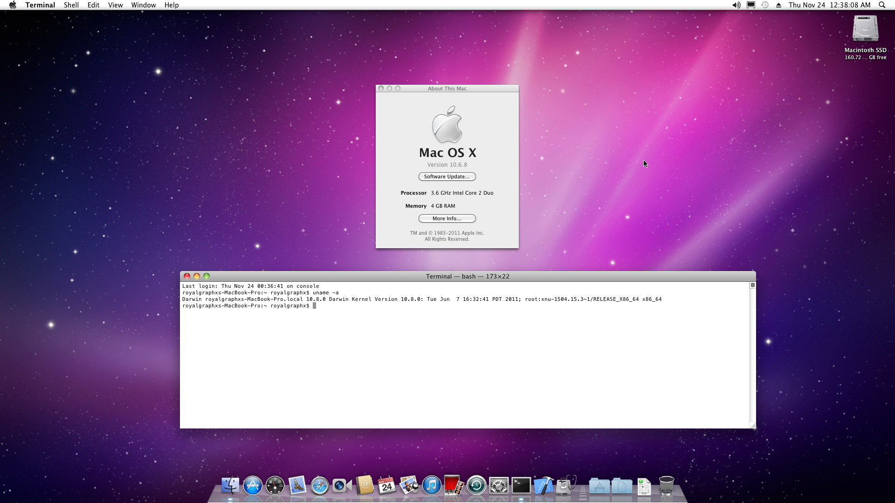
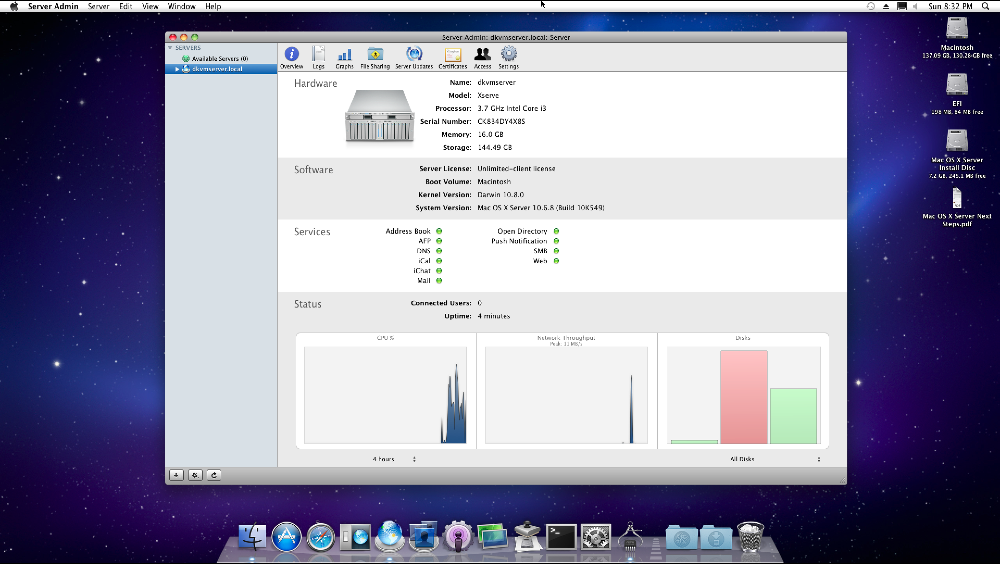
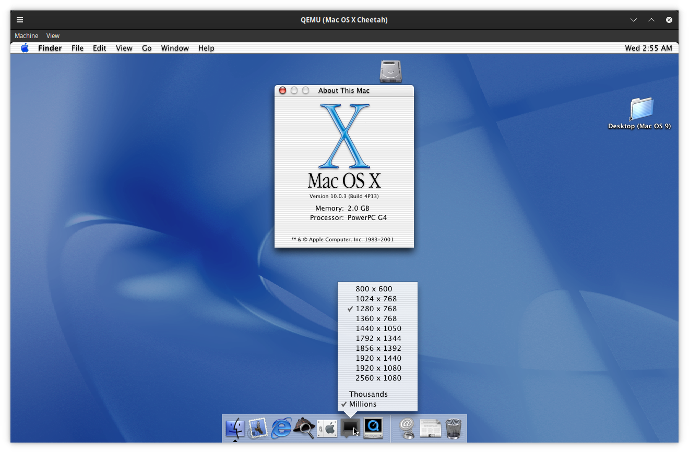

  

  

<h3 align="center">A QEMU Template for 'Legacy' Mac OS X (PPC/Intel) Guests.</h4>
 

<h2 align="center">Current Support Table</h2>

| Mac OS X | Status | Architecture | Boot Script | Installer | Notes |
| --- | --- | --- | --- | --- | --- |
| Version 10.0 : "Cheetah" | Boots, installs, runs | PowerPC | ./Cheetah-Boot.sh | [Download](https://dl.bobpony.com/macos/cheetah/Mac%20OS%20X%2010.0.3.7z)
| Version 10.1 : "Puma" | Boots, installs, runs | PowerPC | ./Puma-Boot.sh | [Download](https://dl-lt1.winworldpc.com/Abandonware%20Operating%20Systems/Macintosh/Apple%20Mac%20OS%20X%2010.1%20(''Puma''%2010.1.5G64).7z)
| Version 10.2: "Jaguar" | Boots, installs, runs | PowerPC | ./Jaguar-Boot.sh | [Download](https://dl.bobpony.com/macos/jaguar/Apple%20Mac%20OS%20X%2010.2%20%2810.2.6C115%29.7z) | Disk 1 & 2 Needed |
| Version 10.3: "Panther" | Boots, installs, runs | PowerPC | ./Panther-Boot.sh | [Disk 1](https://dl-alt1.winworldpc.com/Apple%20Mac%20OS%20X%2010.3.0%20-%20Disk%201.7z) & [Disk 2](https://dl-alt1.winworldpc.com/Apple%20Mac%20OS%20X%2010.3.0%20-%20Disk%202.7z)| Disk 1 & 2 Needed |
| Version 10.4: "Tiger" | Boots, installs, runs | PowerPC | ./Tiger-Boot.sh | [Download](https://drive.google.com/file/d/16IHD6UjQUSfAudv8UrICOMudaVSeOorV/view)
| Version 10.5: "Leopard" | Boots, installs, runs | PowerPC / Intel | ./Leopard-PPC-Boot.sh & ./Leopard-Intel-Boot.sh | [Download PPC](https://macintoshgarden.org/apps/mac-osx-mac-os-10-ppc?page=1) & [Download Intel](https://archive.org/details/OsxLeopardInstall)
| Version 10.6: "Snow Leopard" | Boots, installs, runs | PowerPC (?) / Intel | ./SLeopard-Boot.sh | [Download](https://www.dropbox.com/s/9qeeuiasp8l0rys/sl_utm.qcow2?dl=0) | [Download 1920x1080p-OpenCoreSLeopard.img](https://www.dropbox.com/s/xwf1py4tw3d3qjg/1920x1080-OpenCoreSLeopard.img?dl=0) |
| Version 10.7: "Lion" | Untested | Intel  | ./Lion-Boot.sh | [Download](https://archive.org/details/install-mac-os-x-lion-10.7.0-lion) | |
| Version 10.8: "Mountain Lion" | Boots, installs, runs | Intel | ./MLion-Boot.sh | [Download](https://archive.org/details/osxmountainlion1085) | |
| Version 10.9: "Mavericks" | Untested | Intel | ./Mavericks-Boot.sh | [Download](https://archive.org/details/OSXMavericksInstallDVD) | |
| Version 10.10: "Yosemite" | Untested | Intel | ./Yosemite-Boot.sh | [Download](http://swcdn.apple.com/content/downloads/21/09/031-20634/8d84o1ky5gn2agnf5kiz9eed134n7y3q4c/RecoveryHDUpdate.pkg)
| Version 10.11: "El Capitan" | Untested | Intel | ./Capitan-Boot.sh | [Download](http://swcdn.apple.com/content/downloads/08/58/031-45768/yy0xr85ltis3a7mxuqf3zgaw7sovupckd7/RecoveryHDUpdate.pkg)
| Version 10.12: "Sierra" | Boots, installs, runs | Intel | ./Sierra-Boot.sh | [Download](http://swcdn.apple.com/content/downloads/01/53/031-86778/pnekzincp6rkf5iu91onj1bm5mw1gotnwg/RecoveryHDUpdate.pkg)

<h5 align="center">For anything Mac OS X 10.13 High Sierra and above, please refer to <a href="https://royalgraphx.github.io/DarwinKVM/">DarwinKVM</a></h5>

 
<h3 align="center">Info Center</h3>
<h5 align="center"><a href="./info/REPO_STRUCT.md">REPO_STRUCT.md</a> - Explains repository files/folders.</h5>
<h5 align="center"><a href="./info/AS_SL.md">AS_SL.md</a> - Explains how to run Snow Leopard on Apple Silicon</h5>
<h5 align="center"><a href="./info/CONVERSIONS.md">CONVERSIONS.md</a> - Explains outdated method for converting various files.</h5>
<h5 align="center"><a href="./info/HDD_CREATION.md">HDD_CREATION.md</a> - Explains how to use qemu-img to create a blank .img for installation</h5>

  

<h3 align="center">Mac OS X Sierra (AppleInternal "Phoenix" A1708)</h3>

  

<h3 align="center">Mac OS X Mountain Lion</h3>

  

<h3 align="center">Mac OS X Snow Leopard on Apple Silicon compiling/running i386</h3>

  
  

<h3 align="center">Mac OS X Snow Leopard on x86_64</h3>

  

<h3 align="center">Mac OS X Server Snow Leopard (Xserve2,1)</h3>

  

<h3 align="center">Mac OS X Cheetah (PPC)</h3>

  

<h6 align="center">This project is now deprecated ! Check out <a href="https://docs.darwinkvm.com">DarwinKVM</a> for extended support ꩓</h6>