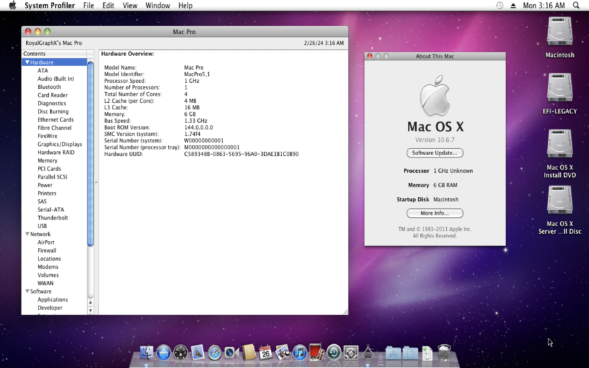
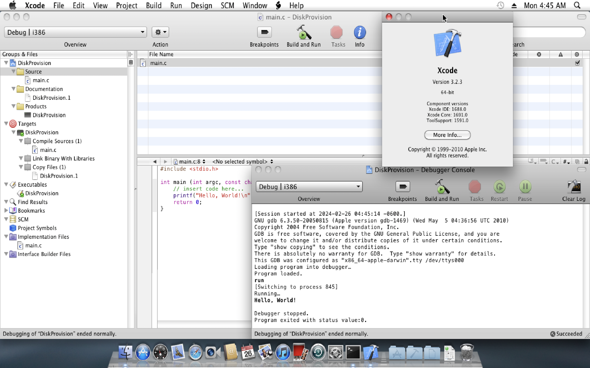

### A Guide on using Snow Leopard on Apple Silicon Macs

This is not an in depth guide explaining the issues with running Snow Leopard on Apple Silicon Macs, as I have other things to work on such as, fixing those issues. You can skip this entire paragraph if all you need to know is how to run Snow Leopard. For now though, all I really need to explain is that for some reason the various KP's that users experience when attempting to first boot or install Mac OS X Snow Leopard on M-Series Macs such as the Commpage or Installer KP are results of some weird TCG/32-Bit emulation errors. As well as OS X itself having trouble with the emulated TCG from ARM64 hosts. I've observed that x86_64 hosts using TCG (or commonly known as simply using emulation and not virtualizing) do not experience such errors. Leads me to believe that the installer uses various older parts for 32-Bit cryptography while installing, and the commpage error mainly being the CPU being weird, as in, how it appears to the guest machine. Reading the actual commpage.c file you'll see the section it kernel panics on. Either way, it turns out it's simply the installer phase. Commpage error was mitigated with OC, and as for the installer randomly having a protection fault 13 during the install, it works perfectly fkn fine once its actually installed lmfao. Also, I personally have not had enough time to properly debug what is happening with TCG on ARM64, so I could be completely wrong on my theory and OC could mitigate every issue if used properly. Take my words with a grain of salt, simply read below on how to actually *use* this guide...

So basically, I installed Mac OS X Snow Leopard to a ``macintosh.img`` on an x86_64 host, my main PC... and then once the screen to reboot appeared, I simply shut the VM down gracefully using the reboot option, and preserved the preinstalled ``macintosh.img`` that is ready for first time boot. It does not have any sort of username or anything, its literally right after install and reboot, so... basically I have to share this ``macintosh_preinstalled.img`` to you guys on Apple Silicon Macs, just in case you do not have an x86_64 machine available to you.

***All you need to do***, is unzip the AS_SL.zip file in ``opencore/`` so that you can get ``AS_SL.img``. Now, you need to download the ``40GB`` disk image of Mac OS X Snow Leopard, and drop it into ``harddrives/`` and rename it from ``macintosh_preinstalled.img`` to ``macintosh.img``. You are now ready to simply use ``AS-SL-Boot.sh``.

As per usual, the ``macintosh_preinstalled.img`` is simply for preservation. As well as allowing users to use older software that they can no longer use. At any moment this image can and will be removed or taken down by the appropriate parties or whoever deems it required to be. Thanks for reading, and hopefully everything works out and boots properly!

[Download macintosh_preinstalled.img](https://www.dropbox.com/scl/fi/rs07j4k7ooc1bqif1w07p/macintosh_preinstall.img?rlkey=bnrvktjghyj4q5no2k5uk79ap&dl=0)

  
  

